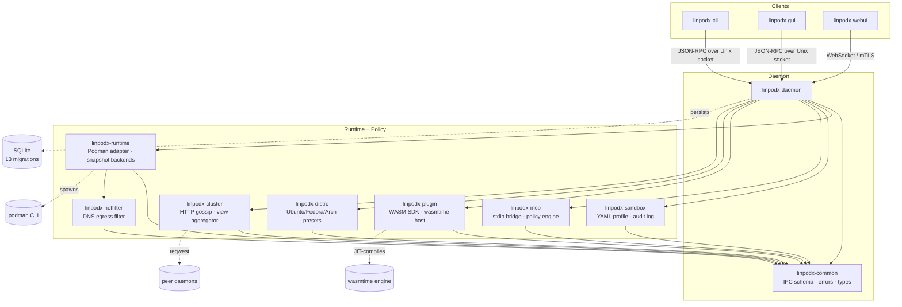
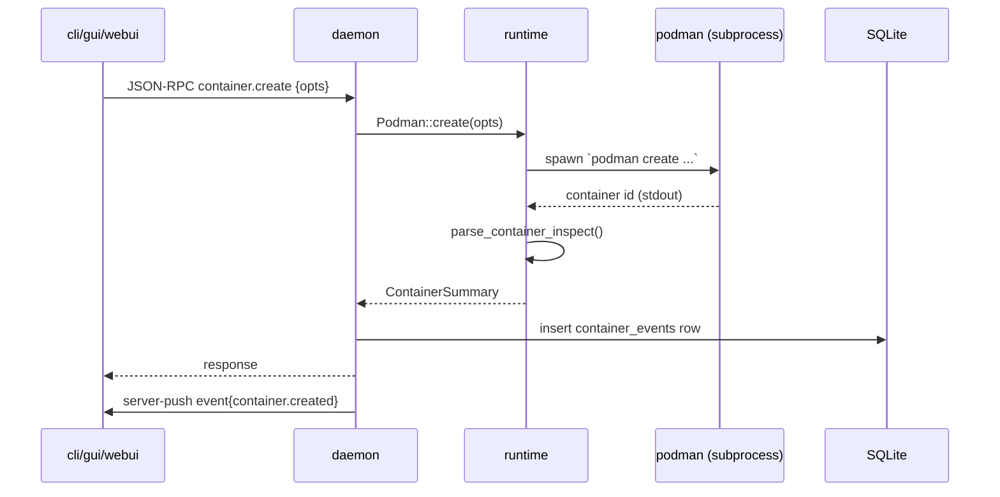
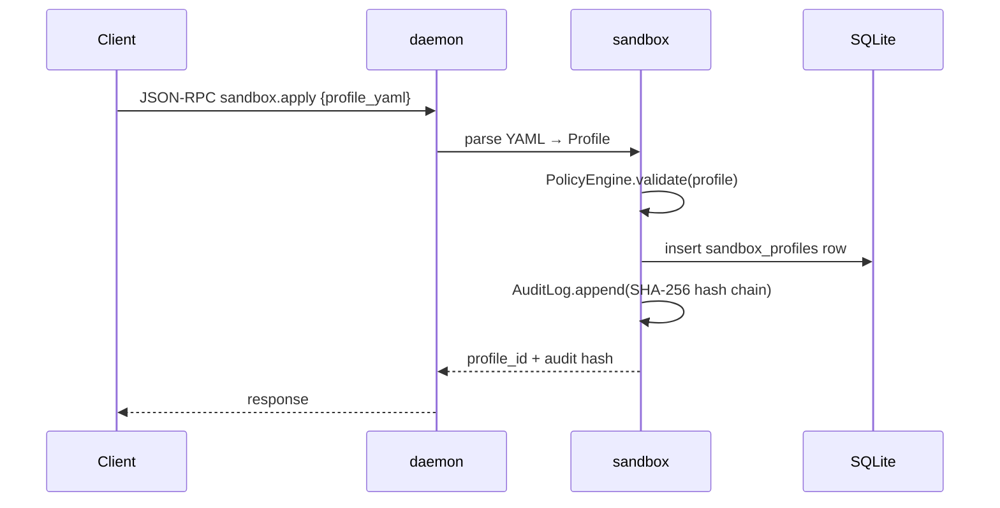
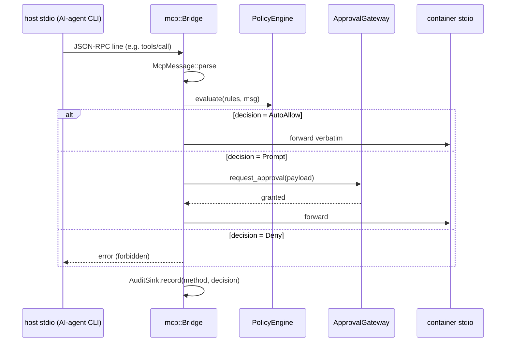
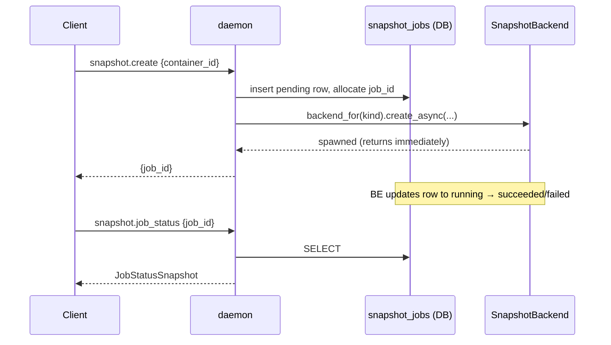
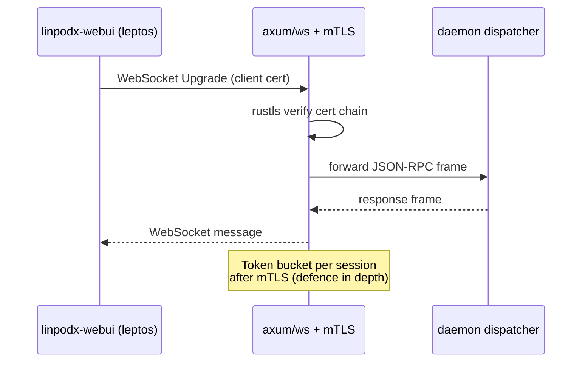

# linpodx Architecture

This document is the canonical map of the linpodx workspace as of the Phase 9
stabilization pass. It covers crate boundaries, the major data flows that cross those
boundaries, and the SQLite schema that ties durable state together.

For motivation and trade-offs behind individual decisions, see the ADRs under
[`docs/adr/`](./adr/). For end-to-end usage walkthroughs, see
[`docs/scenarios/`](./scenarios/).

## 1. Crate Map

### Crates at a glance

| Crate | Responsibility |
|-------|----------------|
| `linpodx-common` | IPC schema (JSON-RPC params + responses), error taxonomy, newtype IDs (`ContainerId`, `ImageId`, …), `AuditSink` / `EventPublisher` / `ApprovalGateway` traits, `MetricsSample`. |
| `linpodx-daemon` | Long-running server. Owns the Unix socket, JSON-RPC dispatcher, SQLite migrations, the broadcast event bus, and the approval registry. |
| `linpodx-cli` | `linpodx` binary. Dumb client over the Unix socket; rendering only. |
| `linpodx-gui` | iced 0.13 desktop app. Read-mostly dashboard subscribed to the event stream. |
| `linpodx-webui` | Leptos SPA served by the daemon over the WebSocket transport. |
| `linpodx-runtime` | Podman wrapper. Container/image/volume/network CRUD, port mapping, snapshot backends (`PodmanCommitBackend`, `OverlayfsBackend`, `BtrfsBackend`), metrics collector, egress enforcer hook. |
| `linpodx-sandbox` | YAML profile parsing, capability/seccomp policy engine, tamper-evident audit log (SHA-256 hash chain). |
| `linpodx-mcp` | Host-stdio ↔ container MCP bridge with audit hooks and per-method `PolicyEngine`. |
| `linpodx-plugin` | WASM plugin SDK + wasmtime host. Hooks: approval, audit-filter, profile-validator. |
| `linpodx-distro` | Per-distro install/launch presets (ubuntu, fedora, alpine, arch). |
| `linpodx-netfilter` | DNS-based egress allowlist. Uses hickory-resolver/server. |
| `linpodx-cluster` | HTTP gossip + container-view aggregation across peer daemons. |

## 2. Core Data Flows

### 2.1 Container CRUD path

### 2.2 Sandbox apply path

### 2.3 MCP bridge path

### 2.4 Snapshot backend path

`SnapshotBackend` is a trait (see [ADR-0008](./adr/0008-snapshotbackend-trait.md)) so the
daemon is agnostic to whether the snapshot lands as a `podman commit` image, an overlayfs
layer, or a Btrfs subvolume.

### 2.5 Remote daemon path

## 3. Persistence

SQLite is the durability store. Migrations live under
`crates/linpodx-daemon/migrations/` and are applied on daemon start.

| # | Migration | Notes |
|---|-----------|-------|
| 0001 | `init` | Bootstrap (containers/images/volumes/networks event log). |
| 0002 | `sandbox_profiles` | YAML profile rows + revisions. |
| 0003 | `audit_log` | Tamper-evident hash chain (SHA-256 over prev_hash + payload). |
| 0004 | `snapshots` | Snapshot metadata (container_id, label, image_ref, size_bytes). |
| 0005 | `mcp_sessions` | One row per active stdio bridge. |
| 0006 | `mcp_events` | Per-message audit (method, decision, latency_ms). |
| 0007 | `distro_instances` | Distro template instantiations. |
| 0008 | `snapshot_jobs` | Async snapshot lifecycle (pending → running → succeeded/failed). |
| 0009 | `mcp_policies` | `(method, tool_name?) → decision` rules. |
| 0010 | `snapshot_branches` | Snapshot lineage / fork tracking. |
| 0011 | `plugins` | Installed WASM plugin manifests. |
| 0012 | `snapshot_backend` | Per-snapshot backend kind discriminator. |
| 0013 | `cluster_peers` | Known peer daemons for gossip. |

## 4. Cross-cutting traits

Three trait surfaces in `linpodx-common` keep the daemon decoupled from concrete
implementations:

- **`EventPublisher`** — daemon broadcast bus; runtime/sandbox emit, GUI/CLI subscribe.
- **`ApprovalGateway`** — runtime/MCP/plugin request approval; CLI listener resolves
  with the user's Y/N answer.
- **`AuditSink`** — sandbox/MCP/runtime hash-chain audit; pluggable target (SQLite by
  default; Noop in tests).

Wiring these as traits kept Phase 2 implementation streams decoupled and testable.
