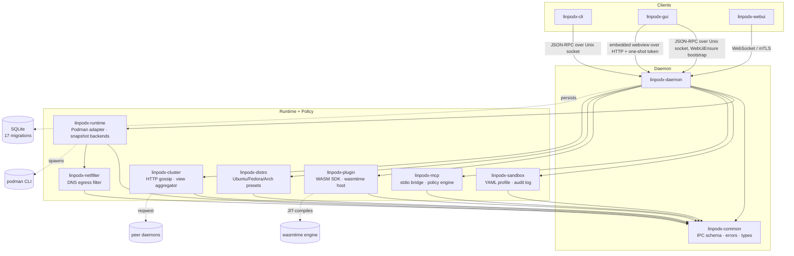
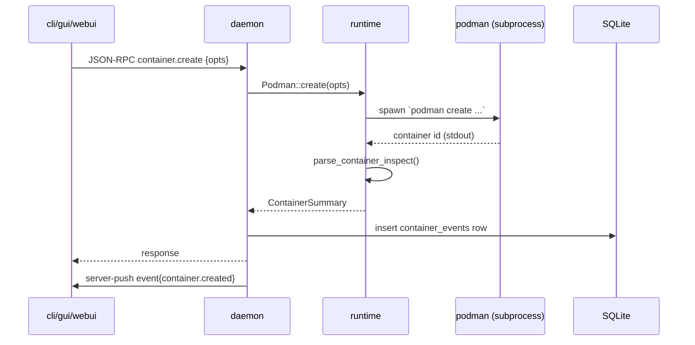
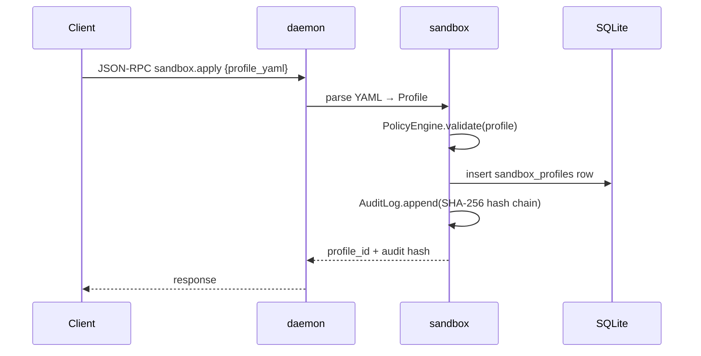
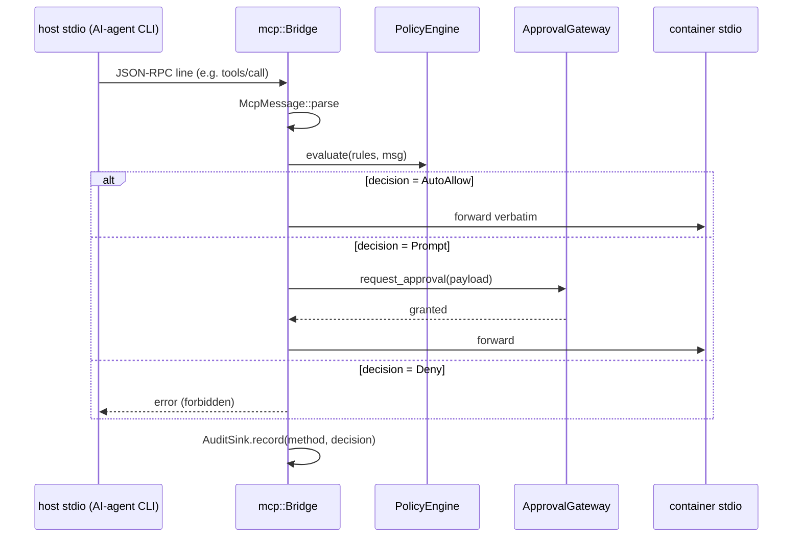
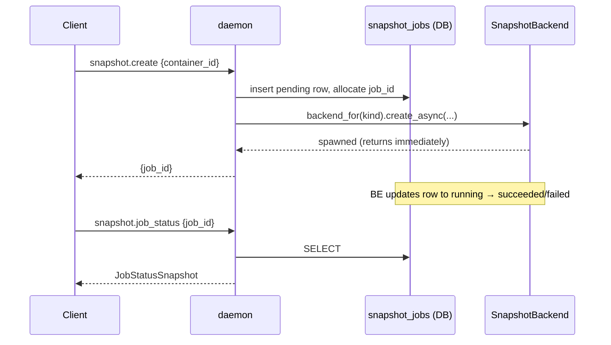
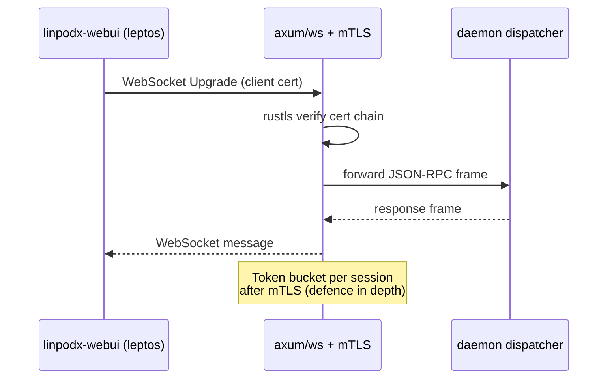

# linpodx Architecture

This document is the canonical map of the linpodx workspace as of the v0.1.x
stabilization line (covering Phase 9 architecture plus the Phase 10–17 additions
listed in §5). It covers crate boundaries, the major data flows that cross those
boundaries, and the SQLite schema that ties durable state together.

For motivation and trade-offs behind individual decisions, see the ADRs under
[`docs/adr/`](./adr/). For end-to-end usage walkthroughs, see
[`docs/scenarios/`](./scenarios/).

## 1. Crate Map

### Crates at a glance

| Crate | Responsibility |
|-------|----------------|
| `linpodx-common` | IPC schema (JSON-RPC params + responses), error taxonomy, newtype IDs (`ContainerId`, `ImageId`, …), `AuditSink` / `EventPublisher` / `ApprovalGateway` / `PluginRevocationSink` traits, `MetricsSample`, passthrough spec. |
| `linpodx-daemon` | Long-running server. Owns the Unix socket, JSON-RPC dispatcher, SQLite migrations, the broadcast event bus, the approval registry, the WebSocket remote transport (token / mTLS / cert-pinning / TOFU), and the embedded Web UI. |
| `linpodx-cli` | `linpodx` binary. Dumb client over the Unix socket or the WebSocket remote; rendering only. |
| `linpodx-gui` | Tauri 2 desktop shell. No native UI of its own: it auto-spawns/connects to the daemon over the Unix socket, calls `WebUiEnsure` for a loopback URL + one-shot token, and points its webview at the daemon-served web UI. |
| `linpodx-webui` | Leptos SPA served by the daemon — over the local loopback listener (`WebUiEnsure`, used by `linpodx-gui`) or the remote WebSocket/mTLS transport. Optional `LINPODX_VENDOR_XTERM=1` air-gapped xterm.js bundle. |
| `linpodx-runtime` | Podman wrapper. Container/image/volume/network CRUD, port mapping, snapshot backends (`PodmanCommitBackend`, `OverlayfsBackend`, `BtrfsBackend`), AES-256-GCM snapshot encryption with Argon2id / SHA-256 KDF and key rotation, OCI tar diff, cgroup-v2 metrics collector, egress enforcer hook. |
| `linpodx-sandbox` | YAML profile parsing, capability / seccomp / AppArmor / SELinux policy engine, tamper-evident audit log (SHA-256 hash chain), auto-encrypt snapshot trigger. |
| `linpodx-mcp` | Host-stdio ↔ container MCP bridge with audit hooks and per-method `PolicyEngine`. |
| `linpodx-plugin` | WASM plugin SDK + wasmtime host. Hooks: approval, audit-filter, profile-validator, network-trace, runtime-injector. Ed25519 signature verification + key registry + cluster-wide revocation. |
| `linpodx-distro` | Per-distro install/launch presets (ubuntu, fedora, alpine, arch, debian, nixos). |
| `linpodx-netfilter` | DNS-based egress allowlist + privileged L4 nftables helper (`linpodx-netfilter-helper`). Uses hickory-resolver/server. |
| `linpodx-cluster` | HTTP gossip + container-view aggregation across peer daemons, openraft state machine (`Noop` / `ProposeContainer` / `RemoveContainer`), Kubernetes read/write adapter. |
| `bench-tools` | Criterion bench harness for cross-crate benchmarks (Argon2id KDF, AES-256-GCM throughput). |
| `tests` | Workspace-level integration tests that span more than one crate. |

## 2. Core Data Flows

### 2.1 Container CRUD path

### 2.2 Sandbox apply path

### 2.3 MCP bridge path

### 2.4 Snapshot backend path

`SnapshotBackend` is a trait (see [ADR-0008](./adr/0008-snapshotbackend-trait.md)) so the
daemon is agnostic to whether the snapshot lands as a `podman commit` image, an overlayfs
layer, or a Btrfs subvolume.

### 2.5 Remote daemon path

## 3. Persistence

SQLite is the durability store. Migrations live under
`crates/linpodx-daemon/migrations/` and are applied on daemon start.

| # | Migration | Notes |
|---|-----------|-------|
| 0001 | `init` | Bootstrap (containers/images/volumes/networks event log). |
| 0002 | `sandbox_profiles` | YAML profile rows + revisions. |
| 0003 | `audit_log` | Tamper-evident hash chain (SHA-256 over prev_hash + payload). |
| 0004 | `snapshots` | Snapshot metadata (container_id, label, image_ref, size_bytes). |
| 0005 | `mcp_sessions` | One row per active stdio bridge. |
| 0006 | `mcp_events` | Per-message audit (method, decision, latency_ms). |
| 0007 | `distro_instances` | Distro template instantiations. |
| 0008 | `snapshot_jobs` | Async snapshot lifecycle (pending → running → succeeded/failed). |
| 0009 | `mcp_policies` | `(method, tool_name?) → decision` rules. |
| 0010 | `snapshot_branches` | Snapshot lineage / fork tracking. |
| 0011 | `plugins` | Installed WASM plugin manifests. |
| 0012 | `snapshot_backend` | Per-snapshot backend kind discriminator. |
| 0013 | `cluster_peers` | Known peer daemons for gossip. |
| 0014 | `raft_state` | Persistent Raft hard-state (term, vote) for the cluster leader-election state machine. |
| 0015 | `pinned_clients` | SHA-256 leaf-DER fingerprints of accepted client certificates for the WebSocket remote listener. |
| 0016 | `snapshot_encryption` | Per-snapshot encryption metadata (algorithm tag, KDF marker) for at-rest AES-256-GCM snapshots. |
| 0017 | `phase17_schema` | Adds `kdf_algorithm` / `kdf_params` / `rotated_from_snapshot_id` / `rotated_at` to `snapshots`, adds `tofu_expires_at` to `pinned_clients`, and creates the `plugin_key_revocations` table. |

## 4. Cross-cutting traits

Three trait surfaces in `linpodx-common` keep the daemon decoupled from concrete
implementations:

- **`EventPublisher`** — daemon broadcast bus; runtime/sandbox emit, GUI/CLI subscribe.
- **`ApprovalGateway`** — runtime/MCP/plugin request approval; CLI listener resolves
  with the user's Y/N answer.
- **`AuditSink`** — sandbox/MCP/runtime hash-chain audit; pluggable target (SQLite by
  default; Noop in tests).
- **`PluginRevocationSink`** — receives cluster-wide plugin-key revocation events from
  the Raft state machine and applies them to the local `KeyRegistry`.

Wiring these as traits kept Phase 2 implementation streams decoupled and testable.

## 5. Phase 10–17 additions

The Phase 9 diagram in §1 still describes the load-bearing shapes. The additions
below extend that picture; none of them changed crate boundaries except for the
new `bench-tools` and `tests` workspace members.

### 5.1 Snapshot encryption + key rotation

Snapshot images can be encrypted at rest with AES-256-GCM. The encryption key is
derived from either `LINPODX_SNAPSHOT_ENCRYPT_PASSPHRASE` (passphrase + KDF) or
`LINPODX_SNAPSHOT_KEY` (raw base64 32-byte key). Two KDF variants are wired:

- **`Argon2id`** — OWASP 2023 baseline (m = 19 456 KiB, t = 2, p = 1).
- **`Sha256Rounds-1k`** — salted SHA-256 with 1 000 iterations, retained for
  backward compatibility with snapshots written before the Argon2 cutover.

Encrypted snapshots store a side-car `blob.enc` plus a `meta.json` that pins the
KDF algorithm and parameters. The `snapshot key-rotate` and
`snapshot re-encrypt-all` workflows perform an atomic rewrite that records
`rotated_from_snapshot_id` and `rotated_at` against the new row. Sandbox
profiles can opt into `auto_encrypt_snapshots: true` so the
`SnapshotEncryptor` adapter encrypts on every pre-run snapshot.

### 5.2 Remote daemon: token / mTLS / cert pinning / TOFU

The remote WebSocket listener now layers four progressive trust modes:

1. **Bearer token** — the v0.1 baseline. Tokens travel through the
   `Sec-WebSocket-Protocol` header (`Bearer.<token>` or `Bearer <token>`) with a
   query-string fallback.
2. **mTLS** — `rustls` server with `WebPkiClientVerifier` and an x509-parser CN
   extractor; the daemon validates the full chain against a configured CA bundle.
3. **Client certificate pinning** — `--pin-clients` keeps a SQLite-backed allow
   list of SHA-256 leaf-DER fingerprints. Pins survive daemon restarts.
4. **TOFU enrollment** — a temporary window during which the first matching
   client fingerprint is auto-pinned. Each TOFU mode carries a `max_age_secs`
   so the latch automatically expires. `TofuExpired` is emitted once per
   expired window.

### 5.3 Plugins: signatures + revocation propagation

WASM plugins are loaded through wasmtime as before, with three additions:

- **Ed25519 signature verification** — every install path
  (params override > detached `signature.b64` > `manifest.signature_b64`) runs
  `verify_strict`. The `KeyRegistry` resolves the publisher's public key in a
  4-tier order (env > XDG > HOME > /etc) with ASCII-stem sanitisation.
- **Key revocation** — `KeyRegistry::revoke()` writes an idempotent
  `<publisher>.revoked` JSON marker; `lookup()` and `list_keys()` are aware of it.
- **Cluster-wide revocation** — `AppData::RevokePluginKey` flows through the
  Raft log; followers apply it via `PluginRevocationSink`. The CLI exposes
  `plugin key revoke --cluster-wide --fingerprint <fp>`, which proposes the
  revocation on the leader and surfaces a leader/follower mismatch as
  `not_leader`.

Two extra hooks landed alongside the signing pipeline: `network_trace`
(Allow / Deny / AuditOnly with `Deny > AuditOnly > Allow` precedence) and
`runtime_injector` (concat-merging environment / command / security-opt
mutations into `CreateOptions`).

### 5.4 Cluster: openraft state machine + Kubernetes write-side

`linpodx-cluster` now hosts a real Raft state machine on top of the Phase 9
gossip layer:

- `AppData` carries three variants: `Noop`, `ProposeContainer`, and
  `RemoveContainer`. The in-memory state is a
  `BTreeMap<(node_id, container_id), ContainerSummary>` that is rebuilt from
  the snapshot payload on `install_snapshot`.
- `RaftHttpFactory` exposes `/append`, `/vote`, and `/snapshot` over axum and
  `reqwest` for inter-node traffic; gossip and Raft membership sync every five
  seconds (`raft_membership_sync_round`).
- `ClusterContainerView` prefers the Raft state once `last_applied > 0` and
  falls back to the gossip aggregate otherwise (backward compatible).

The Kubernetes adapter gained a write side: `create_pod`, `delete_pod`,
`create_namespace`, and `scale_deployment` (JSON merge patch on the
`spec.replicas` field). Mutations are recorded in the local audit log.

### 5.5 Sandbox: SELinux profile generation

For hosts with `checkmodule`, `semodule_package`, and `semodule` (in
permissive or enforcing mode), a sandbox profile with `selinux_type:
<type_name>` synthesises a `.te`, packages it, installs it, and applies the
matching `--security-opt label=type:<type>` flag at container creation. When
`LINPODX_SELINUX_RUNTIME_FALLBACK=1` is set, a dynamic compilation failure
substitutes the static `container_t` label and emits
`SelinuxLabelRuntimeFallback`. Hosts without SELinux tooling skip the step.

### 5.6 Interactive PTY and air-gapped Web UI

`linpodx exec -i -t` allocates a PTY pair on the daemon and pipes it through
`/pty/<bridge_id>` over the WebSocket transport. Each bridge is single-use and
closes when the process exits or the socket disconnects. The CLI switches the
local terminal into raw mode behind a panic-safe `RawModeGuard`.

`LINPODX_VENDOR_XTERM=1` at build time vendors xterm.js into `OUT_DIR` so the
daemon's `/assets/*` route can serve the bundle on air-gapped hosts.

### 5.7 Diff_v2 file-changes

`oci_tar.rs` walks the `podman save` output (manifest.json + per-layer
tar.gz, with `.wh.*` whiteout markers skipped) to produce a file-level
`diff_v2` response, replacing the Phase 7 layer-list summary.
